# Irelands Best Escape Rooms

[Link to live project here](https://breakellrz.github.io/Escape_Room/)

- Irelands Escape Rooms is a website for people of all Escape room experience to check out the best escape rooms in Ireland. (Personal preference) **This website was created for educational purposes.**
- The website has three pages. The home page has a Gencraft ai cyberpunk image as the background with a header main content and footer. The main content in this page is Escape Rooms 101. The second page is the Rooms page. The rooms page involves the same as the home page but a different Gencraft ai cyberpunk image and the main content has four amazing Escape Rooms to see. The third and final page again has a different Gencraft ai cyberpunk image with a form that users can fill out and submit questions to be answered.
  
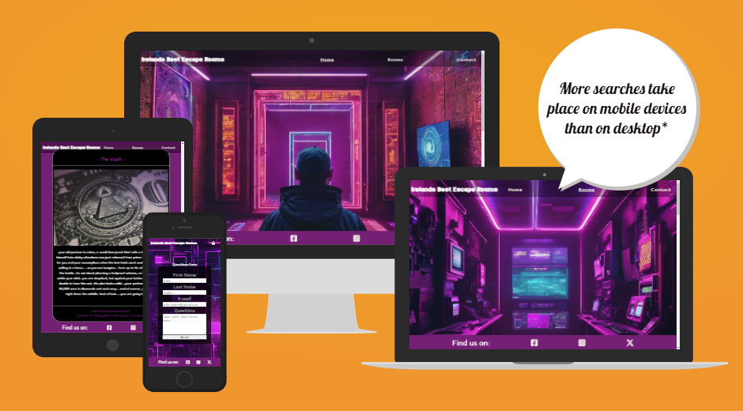

## Goals of this project

### Site owners goals

- To showcase the best Ireland has to offer in Escape Room games.
- To give basic information for new people who might not be knowledgeable on Escape Rooms and how they work.
- Provide good information through text, an external YouTube video and answer any questions users may have.

### External Users goals

- To find out what the best Escape room games in Ireland are.
- To gain insightful information on Escape rooms and how they work.
- To get answers for there questions.

## Design of project

### Strategy plane

The strategy was simple here is some of my thoughts and questions to be answered around the strategy --

- Make a functional static website that would showcase Ireland's best Escape Rooms.
- Is the content culturally appropriate ? The website is for any age, any race, any gender.
- Is the content relevant ? I wanted to make sure the content was relevant to escape rooms.
- I asked my self why would a user want this? The answer was for people interested in Escape Rooms looking for more information on Escape Rooms and to find out the best Escape rooms in Ireland.
- What are we making? Info page on Irelands best Escape Rooms.

### Scope plane

What's on and off the table? What features and content will be used ?

- Normal Navigation Bar for users to click between the three pages(Home, Rooms, Contact).
- Nav bar -- Burger menu on phone screen sizes. Use a lock instead of traditional burger menu -- Have the lock bounce so users know to click it for a dropdown feature.
- background Image with a transparent Header and normal sticky footer - both fixed.
- Information on Escape rooms on the Home page.
- Footer with Social media links.
- YouTube video on Escape Rooms 101.
- Images and information on my top picks for Irelands best Escape Rooms on the Rooms page.
- Contact section with a form feature to submit questions.
  
### Structure plane

Easy structure -- Nav bar with hyperlinks to different pages on website. Scroll down to see main content easy to see layered content displayed in flexbox in columns on each page same layout and structure. It is consistent, predictable, learnable, and visible.

### Skeleton plane

To visualise the website I used Wireframes for my ideas using Balsamiq. I created them on larger screens with the idea of smaller screens being very similar just everything wrapped in columns if need be for the smaller screens.

1. **Home page Example.**
   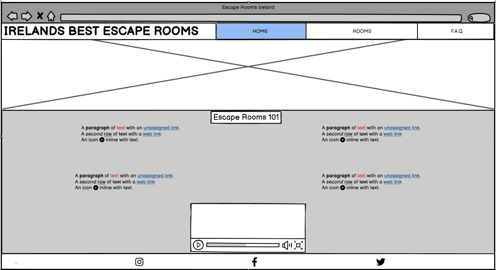

1. **Rooms page Example.**
   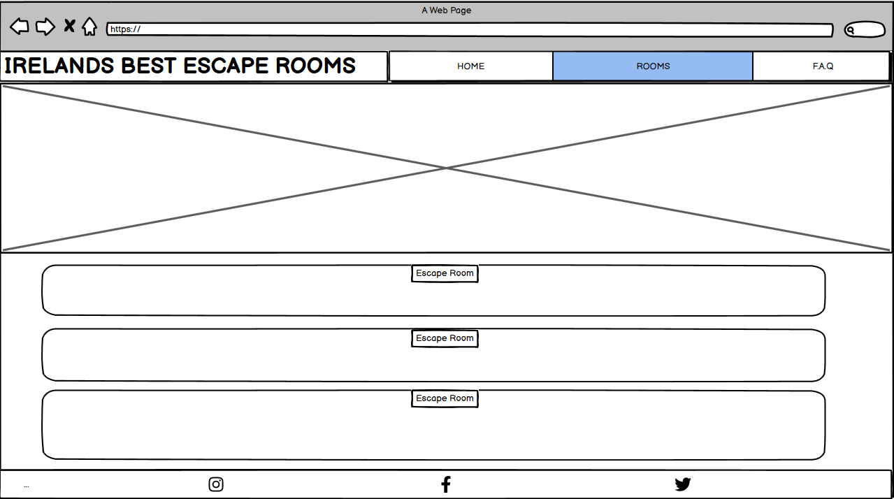

1. **Contact page Example.**
   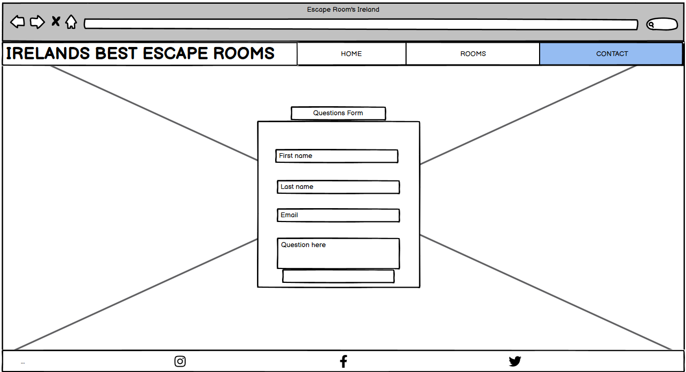

### Surface plane

On the surface plane the color scheme I went for was 'CyberPunk' - The images I got for my main background on all three pages were from gencraft ai [Gencraft wesbite](https://gencraft.com/generate)and I used 'CyberPunk' style.
I decided to then go with the CyberPunk color scheme as it matched my Gencraft ai images for the background on the website. These colors consisted of purples pinks white text with black background. I used 'Eye Dropper' Chrome extension to give me an idea of that colors to use . I used it on the background images from Gencraft. I manually then changed it to my prefered color. 
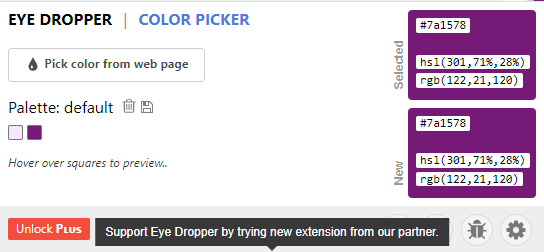

## Features

- My Header consisted of a navigation bar for larger screens and a dropdown menu for smaller screens. All screen sizes had a main h1 heading on the top left of the page with the title 'Irelands Best Escape Rooms' so that users knew what the website was. The header was partially transparent and blends in quite nicely with the main hero background image. 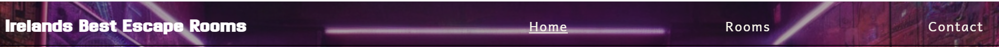

- I used a normal Navigation bar on screen sizes larger then 768px. It contains three pages named 'Home' 'Rooms' & 'Contact'. All three of these are links to each respective page. I used 'class="Active"' for each page so that when the user is on each page it will have an underline under the respective page to tell the user what page they are currently on.
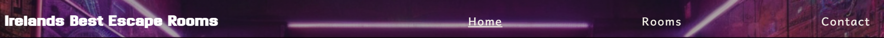  

- I used a dropdown menu for screen sizes smaller then 768px. I decided to use a lock instead of the normal burger menu as a lock corresponds more to the Escape Room Theme. The lock bounces to tell users that it is clickable.

- I used [Gencraft wesbite](https://gencraft.com/generate) for a CyberPunk themed background. I wanted this to stand out and be the first thing users see on the website. 
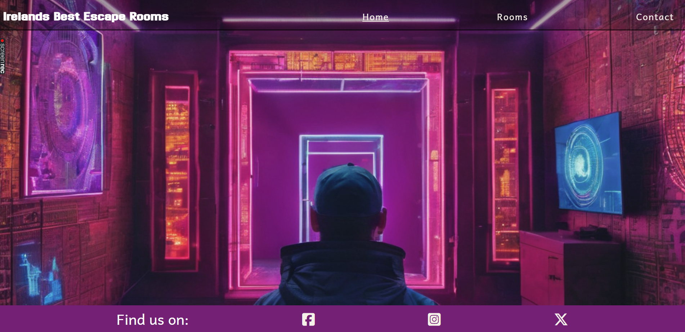

- Content of Escape Rooms 101 - This included four card like sections with a header and information on each card. This was to give knowledge and insight into Escape Rooms for the user. 
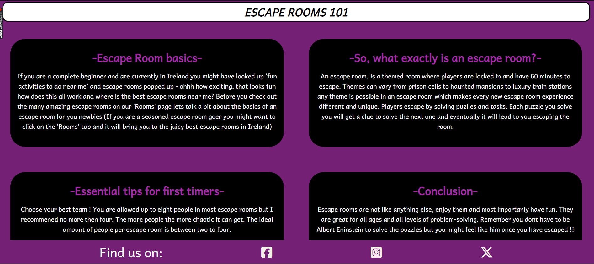

- Footer feature included icons of 'Facebook', 'Instagram' & 'X'. All three icons are clickable links which will take you to each social media website. The footer was fixed so it is always showing like the header. The footer has a background color of #771c75; with white social media icons so it stands out. Also included is text with the words 'Find us on:' so it lets users know they can find us on each social media. (This website was created for educational purposes there is no actual social media for this website so the links take the user to just the home pages of the three social medias.) 

- I added a YouTube video of 'Escape rooms 101' incase users wanted to watch a video format to gain knowledge on Escape Rooms. The video is Scott Nicholson, game design professor at Wilfrid Laurier University in Brantford, Ontario, for an introductory talk on Escape Rooms! This is at the bottom of the page under a line break and above the footer. 
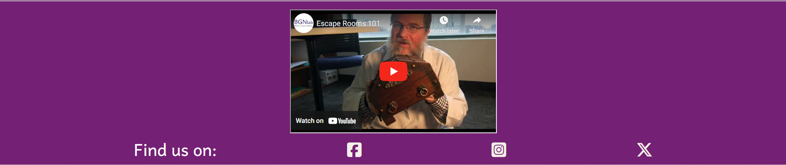

- On the rooms page the website has a main background image from Gencraft with text that says 'Reveal the rooms' and a font awesome hand and finger that points downwards to let the users know to look down to unveil the best rooms.

- The main feature on the 'Rooms' page is the four horizontal like cards with a header, picture and information of four indivdual escape rooms. The headers shows the name of the escape room, The images show a represetation of each room and the information provides the back story for each room and then the location of the escape room. 
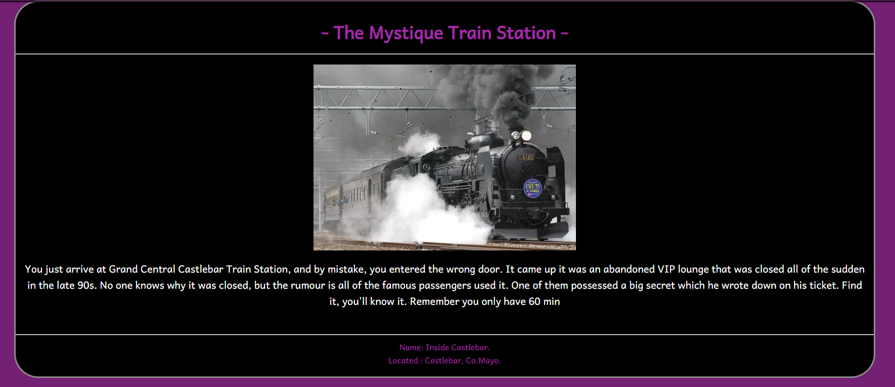 

- Lastly on the 'Contact' page there is a form for users to fill in there 'Name' and 'e-mail' address and to ask a question to be sent to us. (This is for educational purposes when the user clicks send it brings them to a codeinstitute page acknowleging the user that the question has been sent). The form is slightly transparent with a hint of black as the background. The main background is another image from gencraft and the form is on top of this image. It blends in very nicely. 
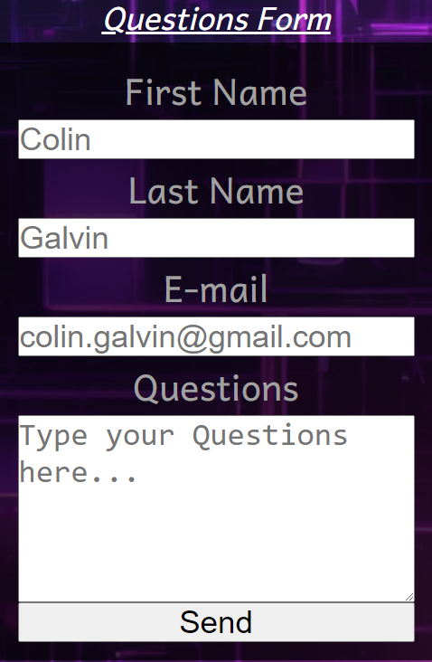

## Future Features

I believe I added the necessary Features for this website but I would have liked to have added more and they will be future features some of these examples are as shown: 

- If I had more time I would have liked to add in a map section with the exact locations of the Escape Rooms that I referred to on the 'Rooms' page.
- I would have like to have added more Escape Rooms and plan on doing so.
- I will add a F.A.Q section of the most common Questions asked.
- I will add an Anchor link to 'Irelands Best Escape Rooms' Main heading.

## Technologies used

Technologies used in this website were as follows:

- HTML
- CSS
- GIT
- BALSAMIQ WIREFRAMES
- CODEANYHWERE
- GOOGLE DEV TOOLS
- GENCRAFT 
- FONTAWESOME
- GOOGLE FONTS
- IMAGE RESIZER
- W3C HTML Markup Validator
- W3C Jigsaw CSS Validator

## Testing and Validation

### Manual testing
- I tested the live project on Google Chrome, Internet explorer and Firefox web browsers.
- I tested the website on iphone, laptop and monitor screen sizes.
- I made sure that the form was working properly on all screen sizes and that the user needs to put in all details for the form to be sent.
- I checked that the lock icon was working as a dropdown menu for phones and that all anchor links worked for all screen sizes. This includes the navigation bar with the pages 'HOME' 'ROOMS' & 'CONTACT'. This also includes the footer with all three social media apps.
  
### Validation
**I used W3C Markup Validation service to make sure my code had no errors. After some fixes my code came out perfect with no errors found.**
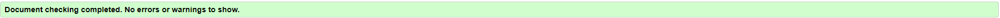 

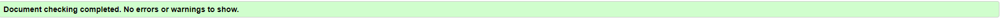 

 

**I used the Jigsaw CSS Vlaidator to vlidate my CSS code.***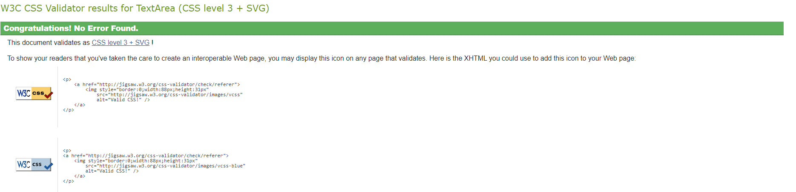 

**I used Lighthouse in dev tools to measure the Performance, Accessibility, Best Practices and SEO I had hoped for a better performance I changed images from jpg to webp and made them smaller I will be working on making the performance better in a future update.** 

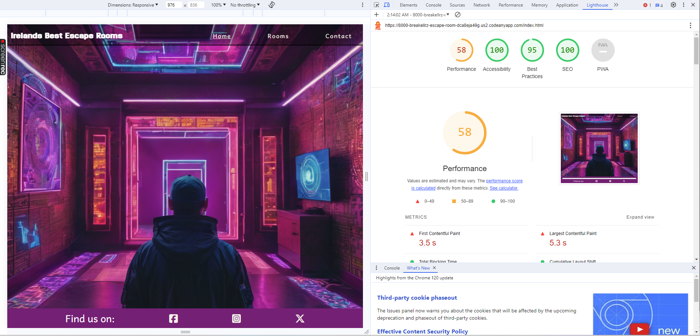

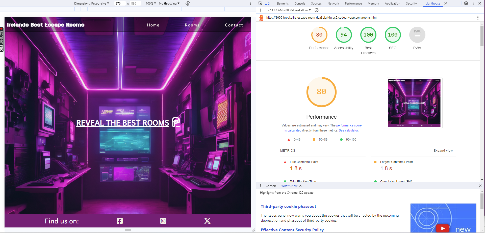

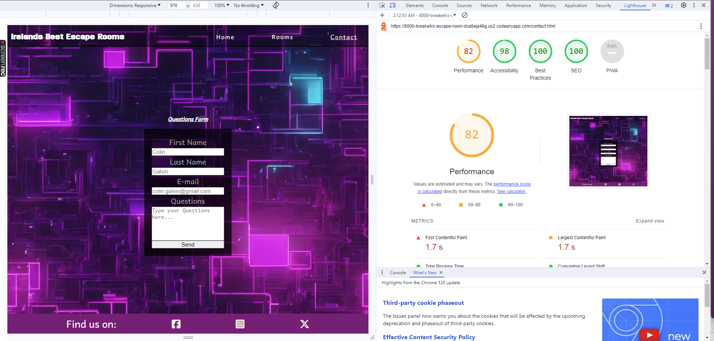

## Challenges/Bug fixes
I had a couple errors and warnings in my HTML code Validator these included a lot of **trailing slashes '/'** that did not need to be in my code - for whatever reason when I got rid of the unnecessary slashes in my code and clicked save the slashes would come back into my code. **I also had a couple errors and warnings that needed fixing these included:**

1. 'Trailing slashes.' 
2. 'Attribute required is only allowed when the input type is checkbox, date, datetime-local, email, file, month, number, password, radio, search, tel, text, time, url, or week.'  
3. 'Section lacks heading. Consider using h2-h6 elements to add identifying headings to all sections, or else use a div element instead for any cases where no heading is needed.' 
4. 'V=Element legend not allowed as child of element div in this context. (Suppressing further errors from this subtree.)'

 **I fixed these issues by:**
 
1. I found a thread on slack with the same issue and got an answer I went into 'file' then 'preferences' then 'settings' then I turned off 'Format on save' this fixed the problem.
2. Removing 'required' in my input type="submit" as required does not make sense to be used in a submit type. This fixed the error.
3. I added a heading with text which ultimately made my 'Rooms' page look nicer and fixed the warning.
4. I took ou the 'legend' tag as it was not needed and I put in a H2 tag instead - this fixed the error.

## Deployment

I deployed my website early as this is recommended. The steps to deploying a website on GitHub pages are:

1. Open the repository and go to the Settings tab.
1. Navigate to the Pages tab in the left menu.
1. Choose Deploy from a branch and select the according branch, main.
1. Click save. Click code The link to the deployed website can be found on the right hand side under 'Deployments' and then under 'active deployments'
   The link to my live site is: [Link to live project here](https://breakellrz.github.io/Escape_Room/)

## Credit
Mentor Brian O'Hare
Gencraft for background images
Love running for nav bar and burger dropdown
pexels for images
font awesome for lock icon
YouTube BGNlab for video
Ealu escape rooms
inside escape rooms
Great Escape rooms
Mentor Brian O'Hare
