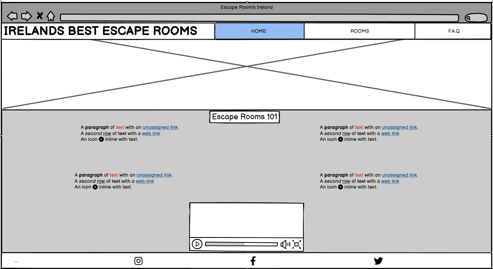
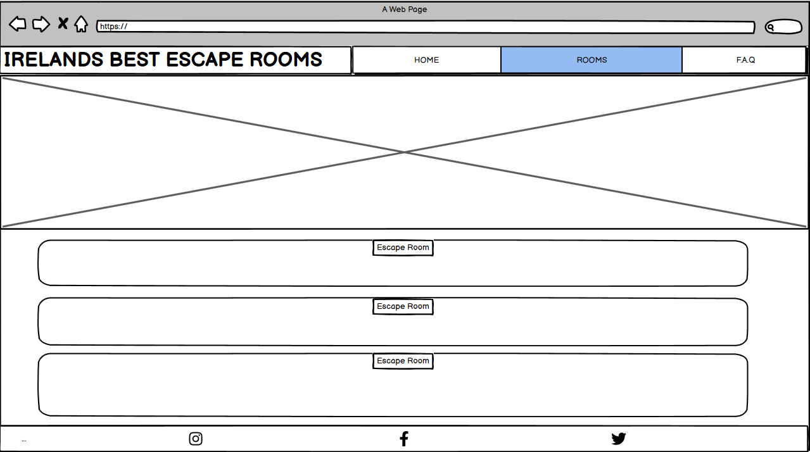
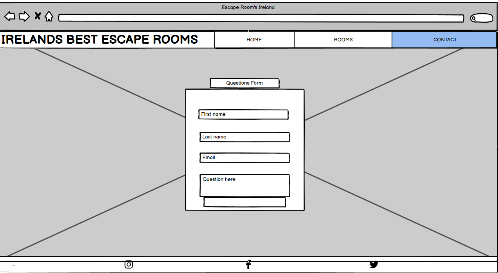

# Irelands Best Escape Rooms

[Link to live project here](https://breakellrz.github.io/Escape_Room/)

- Irelands Escape Rooms is a website for people of all Escape room experience to check out the best escape rooms in Ireland. (Personal preference) This website was created for educational purposes.
- The website has three pages. The home page has a Gencraft ai cyberpunk image as the background with a header main content and footer. The main content in this page is Escape Rooms 101. The second page is the Rooms page. The rooms page involves the same as the home page but a different Gencraft ai cyberpunk image and the main content has four amazing Escape Rooms to see. The third and final page again has a different Gencraft ai cyberpunk image with a form that users can fill out and submit questions to be answered below the form is a F.A.Q section.

[Hero Image on home screen of website](documentation/heroreadme.png)

## Goals of this project

### Site owners goals

- To showcase the best Ireland has to offer in Escape Room games.
- To give basic information for new people who might not be knowledgeable on Escape Rooms and how they work.
- Provide good information through text, an external YouTube video and answer any questions users may have.

### External Users goals

- To find out what the best Escape room games in Ireland are.
- To gain insightful information on Escape rooms and how they work.
- To get answers for there questions.

## Design of project

### Strategy plane

The strategy was simple here is some of my thoughts and questions to be answered around the strategy --

- Make a functional static website that would showcase Ireland's best Escape Rooms.
- Is the content culturally appropriate ? The website is for any age, any race, any gender.
- Is the content relevant ? I wanted to make sure the content was relevant to escape rooms.
- I asked my self why would a user want this? The answer was for people interested in Escape Rooms looking for more information on Escape Rooms and to find out the best Escape rooms in Ireland.
- What are we making? Info page on Irelands best Escape Rooms.
-

### Scope plane

What's on and off the table? What features and content will be used ?

- Nav bar -- Burger menu on phone screen sizes (Use a lock instead of traditional burger menu -- Have the lock bounce so users know to click it for a dropdown feature)
- background Image with a transparent Header and footer so it blends in
- Information on Escape rooms in the Home page
- Footer with Social media links
- YouTube video on Escape Rooms 101
- Images and information on my top picks for Irelands best Escape Rooms on the Rooms page
- F.A.Q section with a form feature to submit questions

### Structure plane

Easy structure -- Nav bar with hyperlinks to different pages on website. Scroll down to see main content easy to see layered content displayed in flexbox in columns on each page same layout and structure. It is consistent, predictable, learnable, and visible.

### Skeleton plane

To visualise the website I used Wireframes for my ideas using Balsamiq. I created them on larger screens with the idea of smaller screens being very similar just everything wrapped in columns if need be for the smaller screens.

**Home page Example.**

**Rooms page Example.**

**Contact page Example.**

### Surface plane

## Future Features

## Technologies used

## Testing

## Challenges/Bug fixes

## Deployment

I deployed my website early as this is recommended. The steps to deploying a website on GitHub pages are:

1. Open the repository and go to the Settings tab.
1. Navigate to the Pages tab in the left menu.
1. Choose Deploy from a branch and select the according branch, main.
1. Click save. Click code The link to the deployed website can be found on the right hand side under 'Deployments' and then under 'active deployments'
   The link to my live site is:

## Credit

Gencraft for background images
Love running for nav bar and burger dropdown
pexels for images
font awesome for lock icon
YouTube BGNlab for video
Ealu escape rooms
inside escape rooms
Great Escape rooms
